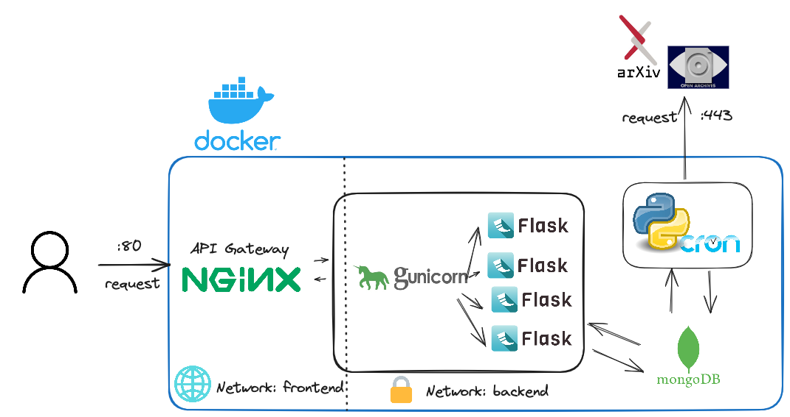

# arXviv API

<div style="text-align:center">
  
</div>

## About the project

The arXviv API project is a comprehensive web application that serves as an interface for retrieving and managing academic articles from ArXiv, a repository of scholarly articles in the field of computer science.

Each day at 23:00 (11 pm), a cron will activate to retrieve 100 articles from the OpenArchive Initiative to store it inside the mongo database. 100 articles is the limit imposed by ARxiv.

The API is made with flask. The API gateway is made with nginx to only communicate with http.

### Built with

- Lazydocker
- LazyVim
- Excalidraw
- Docker
- Python
- Flask

| Linter   | Code Formatting | Code coverage |
| -------- | --------------- | ------------- |
| `Pylint` | `black`         | `pytest-cov`  |

## Architecture

<div style="text-align:center">
  
</div>

This project showcases a comprehensive Dockerized environment for running a web application stack. It includes services for MongoDB, a Python Cron job, a web server with NGINX, and a Flask API. The configuration is orchestrated using Docker Compose, making it easy to deploy and manage.

#### MongoDB Service

The MongoDB service runs the MongoDB database with authentication enabled. It uses environment variables for configuration, allowing flexibility in setting the root username, root password, and initial database. Data persistence is ensured by mounting a volume, and the service is connected to the backend network.

#### Python Cron Service

The Python Cron service is responsible for scheduled tasks and jobs. It utilizes a Docker image built from the provided Dockerfile. The service is configured with UTC timezone and logs are maintained in a separate volume. It depends on the MongoDB service and is connected to the backend network. The code used is the same as the entire project. The cron will only inject data from the "cs" arxset.

#### Web Server with NGINX

The web server service uses NGINX to serve the application. It is built from a Dockerfile and configured for production. The service exposes ports 80, making the application accessible through HTTP. Log data is stored in a dedicated volume, and it depends on the Flask API service. This service is connected to the frontend network.

#### Flask API

The Flask API service provides the core application functionality. It is built from a Dockerfile and configured with environment variables for various settings, including the MongoDB connection details. The service is exposed on port 5000 and depends on the MongoDB service. It is connected to both the frontend and backend networks. It uses gunicorn with 4 workers to

# Getting started

## Installation

0. Clone the repo

```sh
git clone https://gitlab-student.centralesupelec.fr/etienne.vaneecloo/flask_api_crawler_arxiv.git
```

2. Go to docker compose

```
cd flask_api_crawler_arxiv/src/flask_api_crawler_arxiv
```

3. Spin it up

```
docker compose build && docker compose up
```

4. Check that API is running

```
curl http://localhost:80/health
```

5. Populate the database

```
curl http://localhost:80/inject_data_to_mongodb
```

6. You know ready to work with API !!

# API Documentation

> Version 1.0

This documentation provides details about the API endpoints available in the Flask application. Please refer to the following sections for information on each endpoint.

## Get Paginated Articles

> Version 1.0

Endpoint to retrieve paginated articles with 50 articles per page.

### Method

```plaintext
GET /articles/
```

Supported attributes:

| Attribute     | Type | Required | Description                                |
| ------------- | ---- | -------- | ------------------------------------------ |
| `page`        | int  | No       | Page number for pagination (default is 1). |
| `description` | str  | No       | String to be found inside the description. |
| `title`       | str  | No       | Title to be found.                         |
| `start_date`  | str  | No       | Start date.                                |
| `end_date`    | str  | No       | End date.                                  |

#### Success

Returns `200 OK` and the paginated articles in JSON format.

Example request:

```shell
curl --url "http://localhost:80/articles/?page=1"
```

Example response:

```json
[
  {
    "record": {
      "header": {
        "identifier": "oai:arXiv.org:0802.3300",
        "datestamp": "2024-01-18",
        "setSpec": "cs"
      },
      "metadata": {
        "dc": {
          "title": "Projective Expected Utility",
          "creator": "La Mura, Pierfrancesco",
          "subject": [
            "Quantum Physics",
            "Computer Science - Computer Science and Game Theory",
            "Economics - Theoretical Economics"
          ],
          "description": [
            "Motivated by several classic decision-theoretic paradoxes, and by analogies with the paradoxes which in physics motivated the development of quantum mechanics, we introduce a projective generalization of expected utility along the lines of the quantum-mechanical generalization of probability theory. The resulting decision theory accommodates the dominant paradoxes, while retaining significant simplicity and tractability. In particular, every finite game within this larger class of preferences still has an equilibrium.",
            "Comment: 7 pages, to appear in the Proceedings of Quantum Interaction 2008"
          ],
          "date": "2008-02-22",
          "type": "text",
          "identifier": [
            "http://arxiv.org/abs/0802.3300",
            "J. of Math. Psychology, 53:5 (2009)",
            "doi:10.1016/j.jmp.2009.02.001"
          ]
        }
      }
    }
  }
  // More articles...
]
```

#### Failure

Returns `500 Internal Server Error` with an error message in case of failure.

---

## Get Article by ID

> Version 1.0

Endpoint to retrieve an article by its ID.

### Method

```plaintext
GET /article/<id>
```

Supported attributes:

| Attribute | Type | Required | Description              |
| --------- | ---- | -------- | ------------------------ |
| `id`      | str  | Yes      | ObjectId of the article. |

#### Success

Returns `200 OK` and the article details in JSON format.

Example request:
To get the id of an article, simply use one found when populating the databse.

```shell
curl --url "http://localhost:80/article/<id of an article>"
```

Example response:

```json
{
  "record": {
    "header": {
      "identifier": "oai:arXiv.org:0802.3300",
      "datestamp": "2024-01-18",
      "setSpec": "cs"
    },
    "metadata": {
      "dc": {
        "title": "Projective Expected Utility",
        "creator": "La Mura, Pierfrancesco",
        "subject": [
          "Quantum Physics",
          "Computer Science - Computer Science and Game Theory",
          "Economics - Theoretical Economics"
        ],
        "description": [
          "Motivated by several classic decision-theoretic paradoxes, and by analogies with the paradoxes which in physics motivated the development of quantum mechanics, we introduce a projective generalization of expected utility along the lines of the quantum-mechanical generalization of probability theory. The resulting decision theory accommodates the dominant paradoxes, while retaining significant simplicity and tractability. In particular, every finite game within this larger class of preferences still has an equilibrium.",
          "Comment: 7 pages, to appear in the Proceedings of Quantum Interaction 2008"
        ],
        "date": "2008-02-22",
        "type": "text",
        "identifier": [
          "http://arxiv.org/abs/0802.3300",
          "J. of Math. Psychology, 53:5 (2009)",
          "doi:10.1016/j.jmp.2009.02.001"
        ]
      }
    }
  }
}
```

#### Failure

Returns `404 Not Found` with an error message if the article is not found.
Returns `500 Internal Server Error` with an error message in case of other failures.

---

## Get Article Summary by ID

> Version 1.0

Endpoint to retrieve the summary of an article by its ID.

### Method

```plaintext
GET /text/<id>.txt
```

Supported attributes:

| Attribute | Type | Required | Description              |
| --------- | ---- | -------- | ------------------------ |
| `id`      | str  | Yes      | ObjectId of the article. |

#### Success

Returns `200 OK` and the article summary in JSON format.

Example request:

```shell
curl --url "http://localhost:80/text/<id of an article>.txt"
```

Example response:

```json
{
  "record": {
    "header": {
      "identifier": "oai:arXiv.org:0802.3300",
      "datestamp": "2024-01-18",
      "setSpec": "cs"
    },
    "metadata": {
      "dc": {
        "description": [
          "Motivated by several classic decision-theoretic paradoxes, and by analogies with the paradoxes which in physics motivated the development of quantum mechanics, we introduce a projective generalization of expected utility along the lines of the quantum-mechanical generalization of probability theory. The resulting decision theory accommodates the dominant paradoxes, while retaining significant simplicity and tractability. In particular, every finite game within this larger class of preferences still has an equilibrium."
        ]
      }
    }
  }
}
```

#### Failure

Returns `404 Not Found` with an error message if the article is not found.
Returns `500 Internal Server Error` with an error message in case of other failures.

---

## Insert Document from User

> Version 1.0

Endpoint to insert a new document from the user.

### Method

```plaintext
POST /articles
```

Supported attributes in the request body:

| Attribute  | Type | Required | Description                      |
| ---------- | ---- | -------- | -------------------------------- |
| `header`   | dict | Yes      | Header details of the article.   |
| `metadata` | dict | Yes      | Metadata details of the article. |

#### Success

Returns `201 Created` and a success message with the inserted document ID in JSON format.

Example request:

```shell
curl --header "Content-Type: application/json" \
  --request POST \
  --data '{"header": {"identifier": "new_article_id", "datestamp": "2024-01-23", "setSpec": "

ChatGPT

cs"}, "metadata": {"dc": {"title": "New Article"}}}' \
  --url "http://localhost/api/v1/articles"
```

Example response:

```json
{
  "message": "Article inserted successfully",
  "id": "new_article_id"
}
```

#### Failure

Returns `400 Bad Request` with an error message if the request body is invalid.
Returns `500 Internal Server Error` with an error message in case of other failures.

---

## Inject Data to MongoDB

> Version 1.0

This endpoint is responsible for injecting data into MongoDB based on the specified ARXSET parameter. It will gather the article at the date of today.

### Method

```plaintext
GET /inject_data_to_mongodb
```

Supported query parameters:

| Parameter | Type   | Required | Description                                                                                                                  |
| --------- | ------ | -------- | ---------------------------------------------------------------------------------------------------------------------------- |
| `ARXSET`  | string | No       | The ARXSET parameter specifying the data to be injected. If nothing is specified then the API will extract from "cs" arxset. |

#### Success

Returns `200 OK` and a success message in JSON format.
Example request:

```shell
curl --url "http://localhost:80/inject_data_to_mongodb?ARXSET=my_arxset"
```

Example response:

```json
{
  "message": "Data injection completed successfully."
}
```

Failure
Returns 500 Internal Server Error with an error message in case of failure.

```json
{
  "error": "Error during data injection: [Error Message]"
}
```

---

## Get Current Server Time

> Version 1.0

Endpoint to retrieve the current server time.

### Method

```plaintext
GET /time
```

#### Success

Returns `200 OK` and the current server time.

Example request:

```shell
curl --url "http://localhost:80/time"
```

Example response:

```
Current Server Time: 2024-01-23 12:34:56
```

---

## Health Check

> Version 1.0

Health check endpoint returning "OK".

### Method

```plaintext
GET /health
```

#### Success

Returns `200 OK` with the message "OK".

Example request:

```shell
curl --url "http://localhost:80/health"
```

Example response:

```
OK
```

---

## Welcome Message

> Version 1.0

Welcome message endpoint.

### Method

```plaintext
GET /
```

#### Success

Returns `200 OK` with the welcome message.

Example request:

```shell
curl --url "http://localhost:80/"
```

Example response:

```
Welcome to My Flask API!
```

---

## Get API Version

> Version 1.0

Endpoint to retrieve the version information of the Flask API and Python.

### Method

```plaintext
GET /version
```

#### Success

Returns `200 OK` and the version information.

Example request:

```shell
curl --url "http://localhost:80/version"
```

Example response:

```
My Flask API Version: 1.0
Python Version: 3.8.10
```

---

## ASCII Art

> Version 1.0

ASCII art representation of a little bit of trolling.

### Method

```plaintext
GET /umad_bra
```

#### Success

Returns `200 OK` with ASCII art.

Example request:

```shell
curl --url "http://localhost:80/umad_bra"
```

Example response:

```
ASCI ART
```

## Acknowledgments

- http://export.arxiv.org/oai2?verb=ListRecords&from=2023-11-08&set=cs&metadataPrefix=oai_dc
- https://www.digitalocean.com/community/tutorials/how-to-set-up-flask-with-mongodb-and-docker#step-2-writing-the-flask-and-web-server-dockerfiles
- https://github.com/digitalghost-dev/premier-league/tree/main
- https://github.com/othneildrew/Best-README-Template

> [!NOTE]
> This repository contains a personal project designed to enhance my skills in software engineering. It focuses on developping an API that will periodically retrieve feed data into itself from ArXiv via OAI (open archive initiative). Data is stored inside a Mongo database. The API is accessed through nginx.

> [!IMPORTANT]
> Many architectural choices and decisions in this project may not make the most efficent sense on purpose for the sake of practicing and learning.
